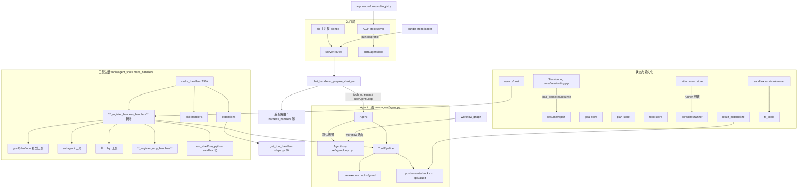

# Harness 能力启用 — 增量架构设计 + 任务分解

- **作者**：高见远（architect-general）
- **版本**：v1.0（2026-09）
- **范围**：将已移植但未进默认运行链路的 harness 能力全部**接通启用**（P0 八项 + P1 三项）；仅接线，不改车辆控制能力。
- **只读调研**：core/agent、core/tools/pipeline、core/chat/runner、core/session/log、tools/agent_tools、tools/fs_tools、server/app_factory、server/routes、server/handlers（chat/harness/attachment/lsp/spill）、goal/plan/todo/subagent/lsp/sandbox/acp/bundle/mcp 各模块。

---

## 1. 总体架构

接线三大汇合点：**工具面**（make_handlers / ToolPipeline / schemas 列表）、**消息面**（core/chat/runner 组装 system+messages）、**进程/路由面**（app_factory / aiohttp routes / ACP stdio）。

**接线结论**：P0 全部落点都在已有汇合点内，无需新建框架层，只需「新增注册函数 + 新增 post-hook + 默认开关 + 少量路由」。

---

## 2. 关键设计决策

### D1 AgentLoop 默认接通（P0-1）
- **方案**：保留 `Agent.run()` 作为分发器；把默认路径改为 `run_with_loop()`。判定顺序：`body.useAgentLoop` 显式值 → 参数 `ai_use_agent_loop`（新参数，默认 True）→ 旧路径兜底。
- **理由**：`run()` 已按 body 字段分支，改动最小；参数默认开可整体回落（置 0 即回旧路径）；不删除旧路径以兼容老调用方。AgentLoop 已具备最大轮次、超时、取消、逐轮事件，满足"禁止无限自循环"。
- **备选**：在 chat_handlers 默认给 body 塞 `useAgentLoop`。缺点：body 是请求体语义，程序逻辑不该由请求隐式决定；参数更利于开关与审计。**取参数方案**。

### D2 模型工具统一注册（P0-2/P0-6）
- **方案**：新增 `tools/harness_tools.py`，导出两个函数：
  - `harness_tool_schemas(params) -> list[dict]`：返回 goal/plan/todo/subagent/lsp 的 LLM schema；
  - `register_harness_handlers(handlers, *, params, get_state_reader, toolbox) -> None`：把处理函数写进 handlers dict。
  在 `make_handlers` 末尾（`_register_skill_handlers` 旁）调用 `register_harness_handlers(...)`；同时在 chat_handlers 组装 tool_list 时并入 `harness_tool_schemas()`。
- **理由**：handlers 与 schemas 本就走两条线（ToolPipeline 执行 vs LLM 可见），对齐现有 extensions/skill 模式，零新概念。
- **备选**：在 pipeline.register(ToolDefinition) 内统一登记并自动 expose schema。缺点：会让 schema 全量进 LLM，失去 toolset 裁剪；保持现有分离更稳。

### D3 附件注入 LLM（P0-3）
- **方案**：在 `core/chat/runner.build_chat_messages`，于已有 `labeled_parts` 列表新增 `("attachments", block, ...)`。从 `body.attachments` 或 user content 基准 `attachment://<id>`（正则抽提取 id）收集附件 id，调用 `attachment_context_prompt(AttachmentStore(), ids)` 生成受限上下文块，追加为 system part。附件粒度上限、mime 白名单、每附件 4000 字符沿用 attachment/context.py。
- **理由**：runner 是唯一 system/messages 组装点，skills_block/workspace 都在此处注入，附件属于"检索型 context"，放 system part 最贴合现有分层。
- **消息结构假设**：`messages` 为 OpenAI 风格 `{role, content}`；附件以 body 字段 `attachments: [id,...]` 显式声明，或 content 内 `attachment://id` 内联引用；跨 session 访问在 store.get 层已隔离。
- **备选**：作为独立 user 消息插入。缺点：会改变对话轮次计数与 compaction 行为；system part 更可预算。**取 system part**。

### D4 spill post-execute（P0-4）
- **方案**：给各 Agent 的 ToolPipeline `pipeline.add_post_hook(_spill_post_hook)`。hook 复用 `tools/result_externalize.externalize_if_needed`：结果序列化超阈值 → 写盘并返回指针 dict（`{ok,externalized,ref,path,preview,hint}`），`kind=accept,result=指针`；阈值读 `ai_externalize_threshold`、开关 `ai_externalize_results`（已存在）。**跳过名含 read/grep/read_file 的工具**防循环；非 dict 结果、无 session 一律原样回退（返回 accept 但 result=None 不改值）；不得把成功改失败。
- **理由**：result_externalize 已是"工具结果盘片化"的现成实现，与 PRD P0-4 的 post-execute waterfall 一一对应。`app["spill_manager"]`（会话摘要型）用于长对话压缩，二者职责不同，不混用。
- **阈值配置**：沿用 `ai_externalize_results` + `ai_externalize_threshold`（已有 harness/config 接口可改）。
- **备选**：接入 SpillManager（会话摘要）。错位——SpillManager 摘要对话，非工具结果，且其 store 是内存无盘。**不采用**。

### D5 sandbox 接入 shell/python（P0-5）
- **方案**：新增 `core/tools/sandbox_hooks.py`，持有进程级单例 `ShellRunner(workspace_root=workspace_path())` 与 `PythonRunner`。改 `fs_tools.run_command/run_shell_command`（agent_tools h_run_shell_command/h_run_shell 路径）先过 `ShellRunner`：命令摘要/禁词/禁正则拦截 → 统一 timeout/cwd/env/输出上限 → 返回 RunResult.to_dict()。新增 `run_python_code` harness 工具走 `PythonRunner`。
- **默认策略**：`ai_sandbox_shell`（默认 True）启用；默认 `SandboxMode="read-only"`（危险操作需 `workspace-write`/`danger-full-access` 由 profile 提升并可审计）。
- **向后兼容**：sandbox 不可用（无 PythonRunner/子进程异常）时回退到原 subprocess 并记 cloudlog；开关置 0 时直走原路径。
- **理由**：ShellRunner/PythonRunner 已完整实现拦截与输出上限，接入是对齐 PRD；拦截逻辑保留 BLOCKED_PATTERNS 可继续防车辆控制类命令。

### D6 MCP 工具桥接（P0-8）
- **方案**：`register_mcp_handlers(handlers, params)` 在 make_handlers 内调用。对 `params("ai_mcp_servers")` 中 `enabled` 的每个 server `discover_mcp_tools` 缓存工具列表，按 `mcp_<server>_<tool>` 命名空间注册 handler → 调 `call_mcp_tool(server_id, tool_name, args)`。默认 deny（未配置/未 enabled 的 server 不注册、LLM 不可见）；名称冲突在注册时后缀去重。
- **理由**：ai/mcp/host.py 已提供 discover/call，桥接只在注册层加一层 namespace，无需重构既有 HTTP 面板（phase2 api_platform_mcp 继续管配置 CRUD）。
- **备选**：改写 phase2 的 MCP 管理为长连 client。过度；stdio 按调用拉起已够用，P2 再升级。**不采用**。

### D7 session resume/repair（P0-7）
- **方案**：`SessionLog.load_persisted=True` + `transcript_store.recover_partial`（已存在）实现确定性修复：截断损坏尾部非 JSON 行、补齐 seq（`_load_from_disk` 用 append 天然重编号）、把 `TOOL_CALL` 无配 `TOOL_RESULT` 的未完成调用标记为 `interrupted`（遍历 surface 求差集），并返回 `{ok, repaired:[...], interrupted:[...]}`。新路由：`POST /api/ai/sessions/{id}/resume`（replay 事件重建 goal/plan/todo/工具上下文）。重复恢复幂等：resume 只读事件不产生副作用，写入另开新 seq。
- **理由**：SessionLog 已是 append-only + persist JSONL，recover_partial 已有截断恢复；repair 只做可推导修复，**绝不臆造模型结果**（不可修复冲突直接给结构化错误并保留原文件副本）。

### D8 ACP stdio server 进程形态（P1-1）
- **方案**：**独立进程** `ai/cli/acp_server.py`（`python -m ai.cli.acp_server`），contrast 仅在启动时建 Agent/session。协议：MCP 风格 newline-JSON-RPC 帧（`Content-Length` 头 + JSON body），stdout 仅协议帧、stderr 全量日志，__init__/session/create/resume/prompt/tools/progress/cancel/shutdown。复用 `run_chat_loop`/AgentLoop 与 `make_handlers`。`--smoke` 无密钥自测。
- **理由**：独立进程隔离日志与协议帧（避免污染 stdout），可被 IDE 直接拉起；复用现有 Agent 扇出最省事。
- **备选**：aid 主进程内线程跑多条 stdio。会与 aiohttp 单进程竞争、难隔离 stdout。**不采用**。

### D9 bundle/profile、workflow_graph 路由（P1-2/P1-3）
- **方案（bundle/profile）**：新增路由 `GET/POST /api/ai/bundle`：manifest 校验（bundle/manifest.py）→ 原子校验依赖与能力冲突 → `BundleStore.install_bundle` 落盘 → `AcpLoader` 展开 providers → 把 `AcpToolProvider` 工具与 `AcpMcpProvider`(→MCP server) 注入 handlers。profile 用参数组合（sandbox 模式、MCP allowlist、spill 阈值），写 session 元数据；敏感配置（env、密钥）不进模型 context。现有 `register_profile_routes` 保留。
- **方案（workflow_graph）**：路由已存在（api_workflows_custom）。gap 在"按图路由"：AgentLoop 读 `workflow_id` → `workflow_graph.load_graphs()` 取起点节点，作为每轮 before_chat_round 的轻量路由（条件/重试上限/人工确认/并行串行），节点不满足 requires_tools 提前失败并给替代路径；成功/失败写回节点状态。最小实现为新增 `workflow_advance` harness 工具 + AgentLoop 在 step 边界查询一次图。

---

## 3. 文件级改动清单

| 文件路径 | 改动类型 | 改动内容 | 依赖 |
|---|---|---|---|
| `tools/harness_tools.py` | 新增 | `harness_tool_schemas()`、`register_harness_handlers()`、`register_mcp_handlers()`；goal/plan/todo/subagent/lsp 工具封装 | goal/plan/todo/subagent/lsp store、ai/mcp/host |
| `tools/agent_tools.py` | 修改 | `make_handlers` 末尾调用 `register_harness_handlers`、`register_mcp_handlers` | 本文件 |
| `server/handlers/chat_handlers.py` | 修改 | `_prepare_chat_run` 把 `harness_tool_schemas()` 并入 tools 列表 | harness_tools |
| `core/agent/agent.py` | 修改 | `run()` 默认走 `run_with_loop()`（参数 `ai_use_agent_loop`）；构造时 `add_post_hook(spill)`、`add_pre_hook(sandbox)` | pipeline、params |
| `core/chat/runner.py` | 修改 | `build_chat_messages` 新增 attachments labeled part（解析 `attachment://` + body.attachments） | attachment/store+context |
| `core/tools/sandbox_hooks.py` | 新增 | ShellRunner/PythonRunner 单例工厂 + 通过策略决议 | sandbox/runtime+runner |
| `tools/fs_tools.py` | 修改 | run_command/run_shell_command 走 shell sandbox（回退保兼容） | sandbox_hooks |
| `core/agent/loop.py` | 修改 | workflow_graph 按图路由钩子（step 边界） | workflow_graph |
| `server/handlers/session_handlers.py` | 新增 | `/api/ai/sessions/{id}/resume|repair` | core/session/log、transcript_store |
| `server/routes/__init__.py` | 修改 | 注册 resume/repair、`/api/ai/bundle`、`/api/ai/profile/current` | session_handlers、bundle |
| `server/handlers/bundle_handlers.py` | 新增 | bundle 校验/安装/provider 注入 | acp/loader、bundle/store |
| `cli/acp_server.py` | 新增 | stdio JSON-RPC server（`--smoke`） | run_chat_loop、make_handlers |
| `core/session/log.py` | 修改 | 增加 `resume_ctx()`（重建 goal/plan/todo ref + interrupted 标记） | 本文件 |
| `tests/test_harness_enable.py` | 新增 | P0-1~P0-8 冒烟 + P1 主路径 | 全部 |

---

## 4. 数据结构和接口（新增工具 schema 一览）

统一返回遵循 `{ok, error?}`，实体成功 `{ok, <entity>: to_dict()}`。参数均 JSON Schema obj。

| 工具 | 关键 parameters | 返回结构 |
|---|---|---|
| `goal_create` | `objective:str, max_rounds:int?` | `{ok, goal}` |
| `goal_get / goal_edit / goal_complete / goal_pause / goal_resume` | `ref{id,rev?}`, `request{objective?}` 等 | `{ok, goal}` / `{ok, error}` |
| `plan_generate` | `title, steps:[{id,title,requires_tools?}], goal_id?` | `{ok, plan}` |
| `plan_update / plan_activate / plan_step_status / plan_complete` | `plan_id, patch{step_status?}` | `{ok, plan}` |
| `todo_write / todo_clear` | `todos:[{id,title,status,parent_id?}], allow_parallel` | `{ok, counts, items}` |
| `subagent_start` | `agent_id, prompt, tools?, output_schema?, parent_id?, max_depth` | `{ok, task, result?}` |
| `subagent_query / subagent_cancel` | `task_id` | `{ok, task, result}` / `{ok}` |
| `lsp` | `action:enum[goToDefinition,findReferences,goToImplementation,hover], uri, line(1-based), character(1-based UTF-16), workspaceRoot` | `{ok, results:[{path,line,character,label,detail,snippet}]} , truncated?` |
| `run_python_code` | `code, timeout_s?` | `{ok, stdout, stderr, returnCode, errorKind?}` |
| `workflow_advance` | `workflow_id, node_id?, action:enum[step,retry,pause,resume]` | `{ok, graph, node, next}` |

- **goal store**：`get/create/edit/pause/resume/complete/block/clear/increment_round`；**plan store**：`create/get/update/delete/activate/pause/complete/cancel/set_step_status/set_mode`；**todo store**：`write/get/clear`；**subagent pool**：`create_task/run/cancel/get_task/get_result`（`pool.run(task, params, tools, max_tool_rounds)`）。
- **附件 block**（system part）：`[type=attachment, attachmentId, mimeType, name, text, truncated?]`，结构沿用 attachment/context.py。
- **spill 指针**：`{ok:true, externalized:true, ref:"toolresult://…", path, tool, size_bytes, summary, preview, hint}`。
- **resume/repair**：`{ok, sessionId, replayedEvents, reconstructed:{goal,plan,todo}, interrupted:[callId], repaired:[seq], originalCopyPath}`。

---

## 5. 有序任务列表

**Phase 1 — P0 核心（先打通闭环）**
1. 工具注册（D2）：建 `tools/harness_tools.py`，goal/plan/todo/subagent 工具；`make_handlers` 接入 + schemas 并入 chat_handlers。
   → 文件：harness_tools/agent_tools/chat_handlers。**验收**：新会话 LLM 可调用 goal_create 后 todo_write，事件回放一致。
2. AgentLoop 默认（D1）：`agent.py` 分发默认走 run_with_loop，加参数 `ai_use_agent_loop`。
   → 文件：agent.py。**验收**：无开关新会话即走 AgentLoop，旧入口不回退旁路。
3. spill post-execute（D4）：`agent.py` add_post_hook。**验收**：大结果产盘片+指针，read 工具跳过，小/非文本不变。
4. 附件注入（D3）：runner labeled_parts。**验收**：传附件后 LLM 请求 system 含附件块，超限截断。
5. session resume/repair（D7）：log.resume_ctx + resume/repair 路由。**验收**：重启 resume 可续，损坏 repair 报告修复项且不臆造。

**Phase 2 — P0 剩余**
6. LSP 模型工具（P0-6）：harness_tools 内加 `lsp` 工具；坐标 1-based UTF-16，60s 预算，single tool。**验收**：四 action 可见可用，wspace 缺失有确定错误。
7. sandbox 接入（P0-5）：sandbox_hooks + fs_tools 改造 + `run_python_code`。**验收**：允许命令 sandbox 内跑，越权/超时/取消拦截，非管理员原路径兼容。
8. MCP 桥接（P0-8）：register_mcp_handlers + namespace。**验收**：授权 server 工具 LLM 可见可调，未授权不可见，断连可诊断。

**Phase 3 — P1（分批）**
9. ACP stdio server（P1-1）：cli/acp_server.py。**验收**：标准客户端建会话、prompt、增量事件、cancel；`--smoke` 通过；stderr 不污染 stdout。
10. bundle/profile（P1-2）：bundle_handlers + 路由。**验收**：加载最小/dev/read-only profile，冲突原子回滚，敏感配置不进模型。
11. workflow_graph 路由（P1-3）：loop 按图路由 + workflow_advance。**验收**：预置工作流可从入口跑、节点状态持久化、requires_tools 不满足提前失败。

---

## 6. 共享约定
- **错误返回**：一律 `{ok:False, error:<str>}`；实体冲突可附结构化 `{code, detail}`（沿用 harness 409）。
- **事件 emit**：沿用 SSE schema：`tool_call` / `tool_result` / `tool_call_delta` / `content` / `reasoning` / `trace` / `error` / `done`；新增 spill 用 `canvas{artifact}`、resume 用 `session{repaired}`。
- **代码风格**：2 空格缩进、行宽 160、绝对 import rooted at `ai.`；测试为 unittest（OpenpilotTestCase）。
- **开关参数**（params）：`ai_use_agent_loop`、`ai_sandbox_shell`、`ai_externalize_results`/`ai_externalize_threshold`（存）、`ai_mcp_servers`（存）。
- **命名空间**：MCP 工具 `mcp_<server>_<tool>`；spill 指针 `toolresult://`；subagent task `sub-<uuid>`。

---

## 7. 待明确事项（≤5）
1. `ai_use_agent_loop` 默认是否直接置 True（会立即改变所有现有会话行为）；建议先灰度新会话、保留旧参数回退。
2. `run_python_code` 是否在本次新增（P0-5 需 python_runner，但它是**新工具**，需确认安全边界与确认提示）。
3. LSP `findReferences`/`gotoImplementation` 需在 LspClient 补 `textDocument/references`、`textDocument/implementation` 请求方法（现有仅 definition/workspace_symbol/document_symbol）。
4. bundle 注入 handler 的「生效时机」：仅对新会话生效，还是全局即时 reload（涉及 ToolPipeline 重建）。
5. ACP stdio 是否必须新进程，还是可先以 CLI 形式放 `ai/cli/`；smoke 测试是否纳入 CI。